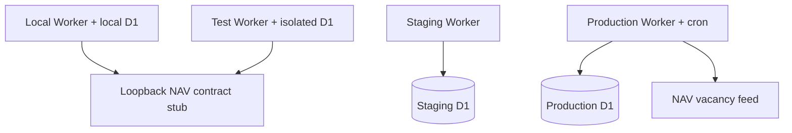

# Deployment architecture

## Environment topology



Local/test/staging/production use the same Rust Worker and ordered migrations,
but they do not share configuration or database identity.

## Source-release contract

The source ZIP exposes two remote entrypoints:

```sh
./deploy             # disposable staging
./deploy-production  # explicit production
```

Both enter the pinned Nix flake and execute the same compiler, policy, migration,
bundle, unit, and local integration gates before any remote mutation.

## Configuration boundary

Committed templates:

- `wrangler.local.jsonc`
- `wrangler.test.jsonc`
- `wrangler.staging.jsonc`
- `wrangler.production.jsonc`

`wrangler.jsonc` is an exact local compatibility alias. Deployment resolves an
environment-specific D1 UUID and writes an ignored account-specific config.

Default resource identities:

```text
job-index-local
job-index-test
job-index-staging       + job-index-staging-db
job-index-production    + job-index-production-db
```

## Test and staging behavior

The test environment points `NAV_BASE_URL` at a loopback standard-library HTTP
stub. `just verify` starts the stub and the real Wrangler Worker, applies all D1
migrations to a fresh state directory, and executes both deterministic fixture
smoke and adversarial NAV contract smoke.

Staging retains demo mutation routes and uses the destructive remote smoke suite.
Scheduled synchronization is disabled so fixture resets cannot race a cron run.

## Production behavior

Production requires a private NAV token, an admin token, and HTTPS corresponding
source URL before Cloudflare resources are changed. Deployment first publishes a
bootstrap version with synchronization and cron disabled, uploads both secrets,
then publishes the final cron-enabled configuration. It disables demo mutation
and public-token fallback and uses a non-destructive smoke suite.

`GET /api/about` exposes the license, environment, and corresponding-source URL.
The browser UI links to the same URL.

## Generated state

- `.wrangler/state`: persistent local development D1;
- `.wrangler/test-state`: recreated local verification D1;
- `wrangler.<environment>.deploy.jsonc`: generated D1 binding config;
- `.deploy/<environment>.json`: URL, D1 identity, config digest, auth mode, and smoke mode;
- `.artifacts/`: build, logs, and smoke responses.

## Deferred infrastructure

Cloudflare Workflows, Queues, Durable Objects, Pipelines, R2, and Analytics
Engine remain threshold-based additions. See the
[Cloudflare product-fit decision](../../../research/decisions/2026-08-05-cloudflare-product-fit.md).
