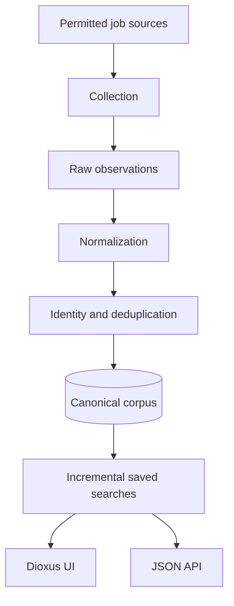

# Architecture overview

## Production-shaped direction

The eventual system separates collection, corpus indexing, matching, public API, and agent adapters. The prototype deliberately collapses these into one application.

## Stable domain boundaries

Even in one process, maintain these logical packages:

- `domain`: canonical IDs, jobs, occurrences, changes, searches.
- `sources`: connector interface and source adapters.
- `normalize`: source-independent representation.
- `deduplicate`: deterministic identity decisions.
- `repository`: transactions and queries.
- `search`: query normalization, evaluation, and change cursors.
- `api`: stable JSON interface.
- `ui`: first-party Dioxus client.
- `demo`: deterministic replay and metrics.

The process boundary may change later; domain boundaries should not.
