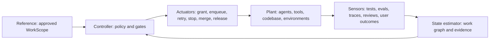
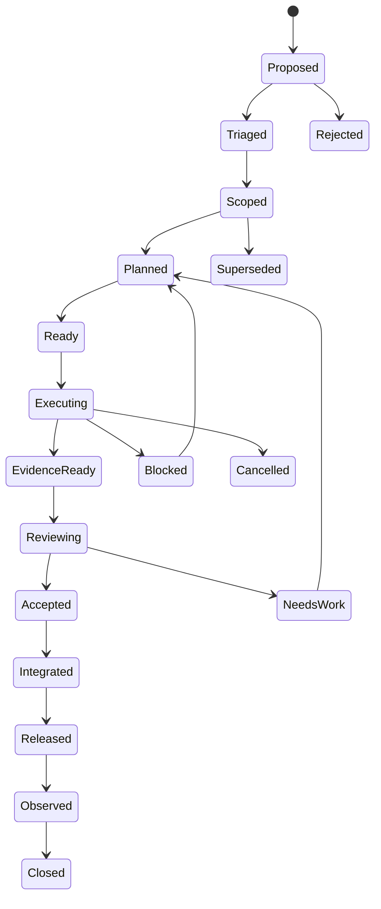

# Cybernetic Agent Development Life Cycle

## Purpose

The ADLC governs software work performed partly or wholly by agents. It extends normal SDLC controls to address nondeterminism, context loss, tool side effects, authority ambiguity, self-review bias, provider drift, and long-horizon execution failure.

The lifecycle is not a linear checklist. It is a closed-loop control system.

## Fundamental model

- **Workgraph** is canonical work and outcome truth.
- **Flow** coordinates execution, attempts, supervision, and gates.
- **Chatlog** retains transcripts and derives bounded, evidence-linked memory.
- **Pagu** grants and enforces host capabilities and security policy.
- **Workbench** composes these concerns into a human control surface.

These names describe future integration boundaries; the repository policy can operate independently until those systems exist.

## Lifecycle states

## Transition rule

An agent does not set the state directly. It submits a transition proposal containing:

- Exact work-scope revision.
- Current repository and environment identities.
- Evidence bundle.
- Requested transition.
- Known uncertainty and residual risk.
- Actor identity and capability receipt.

The configured gate evaluates the proposal. Outcomes are `pass`, `fail`, `needs_work`, or `waived`. Waivers are explicit, time-bounded, and human-owned.
