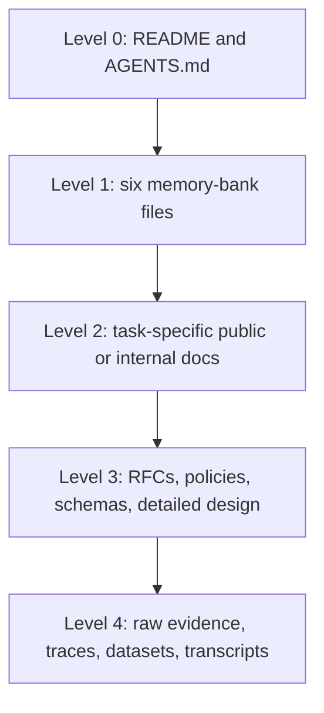

# Documentation and context architecture

## Progressive disclosure



Agents load Levels 0 and 1 by default. They retrieve deeper levels through explicit links and task relevance.

## Public documentation

Public documentation follows Diátaxis:

- **Tutorials:** learning-oriented, guided, concrete first successes.
- **How-to guides:** goal-oriented procedures for known tasks.
- **Reference:** exact, complete descriptions of APIs, schemas, commands, and configuration.
- **Explanation:** conceptual understanding, alternatives, and design rationale.

Do not mix a tutorial narrative into reference pages or turn explanations into procedural checklists.

## Internal agent-oriented documentation

The Cline-inspired memory bank contains six concise files. All six are read at task start, but they summarize and link rather than duplicate detailed documentation.

- `projectbrief.md`: stable foundation and scope.
- `productContext.md`: problem and user outcomes.
- `activeContext.md`: current focus, exact state, next actions.
- `systemPatterns.md`: durable architecture and control patterns.
- `techContext.md`: technology, setup, and constraints.
- `progress.md`: completed, remaining, and known issues.

## Freshness policy

- `activeContext.md` is updated after state-changing work.
- `progress.md` is updated at lifecycle closure or milestone gates.
- Architectural changes require an RFC and corresponding summary update.
- Policy changes modify machine-readable policy first, then narrative docs.
- Public docs change when user-visible behaviour changes.
- Raw transcripts never substitute for curated state.

## Context budget

Core memory files should remain concise. When detail grows, move it into a linked document and leave a summary plus retrieval trigger.

Example:

```text
For connector legal/access policy, read docs/internal/research/platform-index.md
only when adding or modifying a source connector.
```
