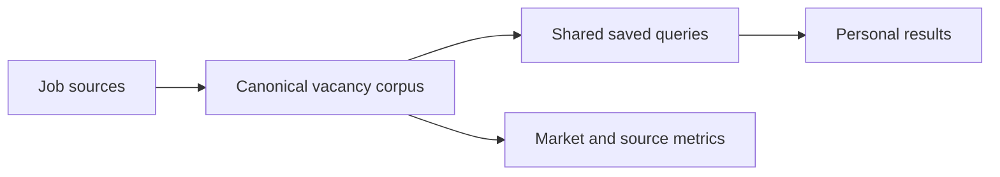

# Product vision

## Problem

Job listings in Norway are fragmented across national boards, aggregators, recruiter portals, public-sector systems, specialist boards, and employer-controlled applicant systems. A person repeating the same search wastes effort, sees duplicates, and loses visibility into what changed.

## Proposed value

The service collects each permitted source once into a shared corpus, resolves source occurrences into canonical vacancies, and evaluates saved searches incrementally.

## Core value propositions

1. One vacancy appears once, with all known source provenance.
2. Repeated searches process only new or changed canonical records.
3. Users see additions, updates, closures, and removals since their previous check.
4. Source integrations are evaluated quantitatively by unique contribution, freshness, and reliability.
5. Developers and agents can consume the same corpus through a documented API.

## Non-goals for the prototype

- Comprehensive ingestion of every indexed platform.
- Automated applications.
- CV-based ranking.
- Machine-learning deduplication.
- Multi-tenant production infrastructure.
- Email, push, MCP, and webhook delivery.
