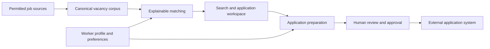

# Product vision

> **Working product name:** Job Application Assistant. Repository and package
> identifiers remain `job-index` until a separate rename decision.

## Core mission

Assist a person through the job-application process: find suitable work,
understand why it matches, retain reusable profile facts, organize the search,
and reduce repetitive application entry while keeping the person in control.

The canonical job corpus is an enabling subsystem, not the product boundary.
The product succeeds when one person can conduct their job search from one
workspace with less repeated searching, data entry, and status tracking.

## MVP

| Included | Deliberately outside the first usable release |
| --- | --- |
| Collect permitted sources into a canonical, provenance-preserving corpus | In-app CV writing |
| Match jobs against credentials, preferences, and constraints | In-app application-letter writing |
| Store reusable worker-profile facts commonly found in CVs and application forms | Autonomous application submission |
| Browse, save, dismiss, prioritize, and track jobs and applications | Automation against sources whose terms or policy are unresolved |
| Reuse profile facts and common answers to prepare repetitive application entry | Replacing the person's review or approval |

CVs and letters may be attached or referenced by the workflow, but the MVP
does not author them. The structured profile exists now because matching and
future application assistance both need the same warranted facts.

The person owns the final transition to an external system.

## Future direction

After the MVP is usable, evaluate:

- ATS-friendly CV and application-letter assistance derived from the
  structured profile and a vacancy;
- Cloudflare Agents SDK and browser/computer-control products for source
  scouting, application-form assistance, and bounded application workflows;
- reusable automation recipes that remember safe, tedious interactions without
  granting autonomous submission authority.

These Cloudflare products are candidate mechanisms, not committed architecture.
Adopt them only where a real journey proves that they reduce work while
preserving source policy, privacy, evidence, bounded execution, and explicit
human approval.

## Product principles

1. **One vacancy, complete provenance.** Merge duplicates conservatively and
   retain where every observation came from.
2. **Match from warranted facts.** Credentials, preferences, constraints, and
   application answers are structured user-owned data, not model guesses.
3. **Automate repetition, not authority.** Agents may scout, prepare, and fill;
   the person reviews consequential output and controls submission.
4. **Progress is durable.** The workspace records what is new, dismissed,
   saved, prepared, submitted, or closed.
5. **Sources remain policy-bound.** An adapter's technical ability never grants
   permission to collect or submit.
