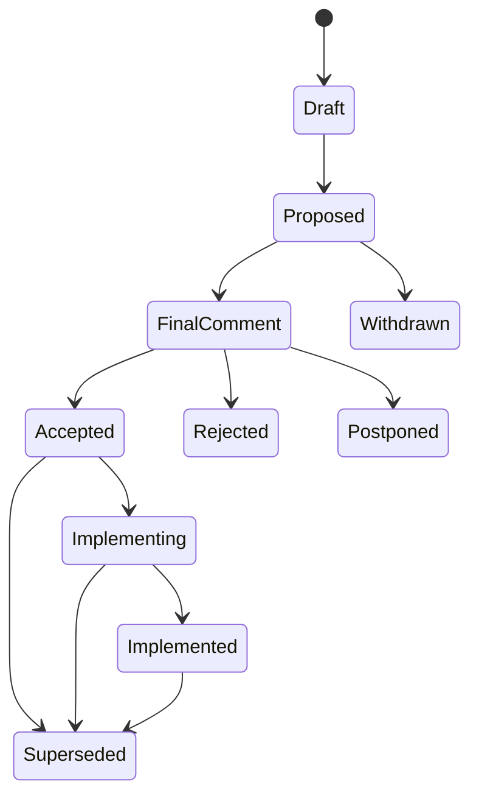

# Request for Comments

Architecture decisions are governed through RFCs. An accepted RFC is the authoritative architectural decision record; there is no separate ADR format.

## When an RFC is required

Create an RFC before a substantial change to any of the following:

- System, container, component, or package boundaries.
- Public API, event, schema, or compatibility contracts.
- Canonical data identity, persistence, migration, or retention.
- Security, privacy, capability, or trust boundaries.
- ADLC lifecycle, authority, evidence, or quality-gate policy.
- Deployment topology or an operational dependency that is difficult to reverse.
- A foundational technology choice or replacement.
- User-visible semantics whose reversal would break clients or stored state.

Normal work scopes and pull requests are sufficient for bug fixes, local refactors that preserve contracts, documentation corrections, tests, and other changes that do not alter architectural meaning.

## Lifecycle

- **Draft:** authoring and early consultation; not implementation authority.
- **Proposed:** complete enough for stakeholder review.
- **Final Comment:** trade-offs are understood and the decision owner requests final objections.
- **Accepted:** architectural direction is approved. Implementation still requires an approved WorkScope and normal ADLC gates.
- **Implementing:** tracked implementation is active.
- **Implemented:** verification and rollout obligations are complete.
- **Rejected:** considered and declined.
- **Postponed:** potentially useful, but not aligned with current priorities or evidence.
- **Withdrawn:** removed by its authors before decision.
- **Superseded:** replaced by a newer RFC.

## Process

1. Copy [`templates/rfc.md`](../../../templates/rfc.md) to `docs/internal/rfcs/0000-short-title.md`.
2. Establish motivation, goals, non-goals, design, alternatives, drawbacks, verification, and rollback before requesting review.
3. Link an approved WorkScope when implementation or repository mutation begins.
4. Request review from affected owners and an independent reviewer.
5. The authorized decision owner moves the RFC into Final Comment when major trade-offs are sufficiently understood.
6. Final Comment ends in acceptance, rejection, or postponement. Agents may propose a disposition but cannot accept their own RFC.
7. Assign the next permanent sequence number before acceptance and record the decision rationale.
8. Track implementation separately. Acceptance is permission to proceed, not proof of implementation.
9. Mark the RFC Implemented only after required evidence and observation gates pass.

## Amendment and supersession

Minor corrections that preserve motivation, applicability, and core design may be recorded under **Amendments** with reviewer approval. A non-local change, a changed motivating use case, or a design with materially different alternatives requires a new RFC that references and supersedes the old RFC.

## Review expectations

Review evaluates:

- Whether the proposal solves a demonstrated problem.
- Whether goals and exclusions are explicit.
- Whether control, state, failure, and migration semantics are implementable.
- Whether alternatives and drawbacks are represented fairly.
- Whether security, privacy, capabilities, operations, and rollback are addressed.
- Whether verification could falsify the proposal's claims.

This process is adapted from the Rust RFC model: substantial changes receive design review and stakeholder comment before implementation, while ordinary fixes remain in the normal pull-request workflow.

## Current RFCs

- [RFC 0004: Cloudflare D1-first Rust MVP](0004-cloudflare-d1-first-rust-mvp.md) — Implementing
- [RFC 0005: Live NAV incremental ingestion](0005-live-nav-incremental-ingestion.md) — Implementing
