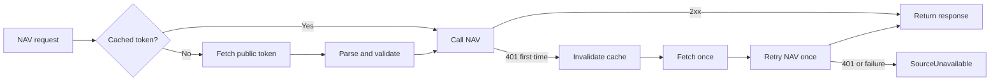

# NAV runtime credential design

**Summary:** Fetch NAV's rotating public prototype token at runtime. Keep one interface for a future private consumer token.

**Status:** Approved design, not implemented.

## Scope

This design covers authentication for NAV feed and detail requests. It also removes token values from builds and tracked deployment state.

The design does not register a private NAV consumer. It does not deploy or change a remote credential.

## Source contract

NAV requires a bearer token for each feed request. NAV publishes two token paths:

| Mode             | Source                                                                 | Lifetime                       |
| ---------------- | ---------------------------------------------------------------------- | ------------------------------ |
| Public prototype | [`/api/publicToken`](https://pam-stilling-feed.nav.no/api/publicToken) | Rotates at irregular intervals |
| Private consumer | Issued after consumer registration                                     | Can have no expiry date        |

The public endpoint returns plain text. The last nonempty line contains the current token.

Official references:

- [NAV feed documentation](https://github.com/navikt/pam-stilling-feed/blob/master/docs/index.markdown)
- [NAV token endpoint implementation](https://github.com/navikt/pam-stilling-feed/blob/master/src/main/kotlin/no/nav/pam/stilling/feed/TokenController.kt)

## Decision

`NavCredential` is the seam between the NAV adapter and credential acquisition.

```text
NavCredential
├── PublicTokenEndpoint
└── PrivateConsumerToken
```

Both adapters return a bearer token at runtime. The NAV adapter does not know where the token came from.

The initial deployment uses `PublicTokenEndpoint`. A future deployment can select `PrivateConsumerToken` through runtime configuration.

## Invariants

| ID         | Invariant                                          | Initial enforcement        |
| ---------- | -------------------------------------------------- | -------------------------- |
| NAV-CRED-1 | A token value never enters the Worker bundle.      | Test plus deployment check |
| NAV-CRED-2 | A token value never enters logs or evidence files. | Review plus log test       |
| NAV-CRED-3 | Public mode fetches the token at runtime.          | Adapter test               |
| NAV-CRED-4 | A 401 response causes one refresh and one retry.   | Adapter test               |
| NAV-CRED-5 | Private mode never falls back to public mode.      | Adapter test               |
| NAV-CRED-6 | Token acquisition has bounded retries.             | Type and test              |

## Public-token flow



The cache belongs to one Worker isolate. Concurrent requests share one token acquisition effect.

The provider refreshes after a 401. It does not poll NAV or refresh on every vacancy request.

## Parsing

The parser performs these steps:

1. Decode the response as text.
2. Select the last nonempty line.
3. Remove surrounding whitespace.
4. Require three nonempty JWT segments.
5. Reject empty, malformed, or non-2xx responses.

The parser does not log the response body. A parse failure becomes `SourceUnavailable` for NAV.

## Private-token mode

A future private token comes from a runtime secret binding. The binding remains outside the JavaScript bundle.

Private mode has these rules:

- The provider reads one runtime secret.
- A missing secret is a configuration failure.
- A 401 does not select public mode.
- A replacement secret takes effect after the next Worker deployment or isolate start.

No private-token registration is part of this work.

## Deployment changes

The implementation removes the public token from:

- tracked Alchemy state.
- deployment environment files.
- generated Worker inputs.
- evidence artifacts.

Alchemy state directories must not be tracked. Existing tracked public-token state is repository noise, not a private-credential incident.

The deployment path must still build fresh Worker and web artifacts. That correction belongs to the deployment-hardening slice.

## Verification

The implementation must cover these observations:

1. A cold public provider fetches and parses one token.
2. Two successful NAV calls reuse the cached token.
3. A first 401 refreshes and retries once.
4. A second 401 returns `SourceUnavailable`.
5. Concurrent cold requests perform one token fetch.
6. Public-token response text never appears in errors or logs.
7. Private mode uses only the runtime secret.
8. The built Worker does not contain a captured token value.

## Implementation sequence

1. Add the `NavCredential` interface and public adapter.
2. Change the NAV adapter to request credentials through the interface.
3. Add bounded 401 refresh behavior.
4. Add the private runtime adapter without activating it.
5. Remove public-token bindings and refresh scripts from deployment inputs.
6. Stop tracking Alchemy state.
7. Run the deployment-hardening and scheduled-ingestion evidence slices.
