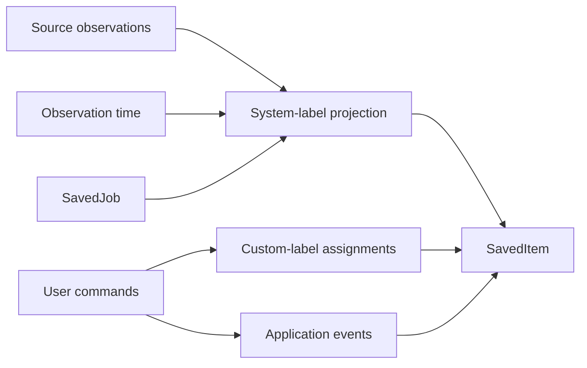

# Saved semantic system design

**Summary:** Add a durable Saved workspace. Use reusable algebras for label sets and exclusive application status.

**Status:** Approved design, not implemented.

## Product surface

The user-facing name is **Saved**. The route is `/saved`.

A saved vacancy remains useful before, during, and after an application. The surface therefore includes bookmarks and application history.

The existing `SavedJob` remains the durable bookmark. A `SavedItem` is a read model, not a new source of truth.

```text
SavedItem
├── saved vacancy snapshot
├── warranted labels
├── current application attempt, if present
└── prior application attempts
```

## Semantic structures

The implementation starts with two reusable structures. Each product instance has a nominal vocabulary.

| Structure                | Meaning                                          | First instance      |
| ------------------------ | ------------------------------------------------ | ------------------- |
| `SetExpression<A>`       | Non-exclusive membership with set operations     | `SavedLabel`        |
| `TransitionSystem<S, E>` | One exclusive state changed by authorized events | `ApplicationStatus` |

A value from one nominal vocabulary cannot enter another. Structural equality does not make `SavedLabel` an `ApplicationStatus`.

A hierarchy structure is not part of this feature. Add it when a real hierarchical product instance exists.

## Set expression

`SetExpression<A>` supports these operations:

- atom.
- union.
- intersection.
- difference.

Difference uses an explicit base expression. The algebra has no implicit universal set.

The evaluator is pure. Property tests cover identity, associativity, commutativity, idempotence, and difference laws.

The generic expression does not appear on the first public HTTP interface. Product presets compile to expressions inside the worker.

## Saved labels

A saved item can have many labels. Labels are warranted set membership, not mutable status fields.

### Reserved projected labels

| Label      | Warrant                                                         | Manual mutation |
| ---------- | --------------------------------------------------------------- | --------------- |
| `saved`    | A `SavedJob` exists for the profile                             | Not allowed     |
| `closed`   | The current source or corpus observation reports closure        | Not allowed     |
| `expired`  | The best warranted deadline precedes the query observation time | Not allowed     |
| `occupied` | A source explicitly reports that the position was filled        | Not allowed     |

Absence means “not warranted.” It does not mean that the opposite is proved.

The deadline projection uses the newest warranted deadline. It uses the saved snapshot only when no newer source observation exists.

NAV currently reports active or inactive. NAV does not warrant `occupied` unless a future source field states that meaning explicitly.

Each projected label includes an evidence reference and authority class in the read model.

### Custom labels

A person can create custom labels and assign them to saved vacancies.

Custom labels have these properties:

- owner-scoped nominal identity.
- a display name.
- a normalized name for owner-scoped uniqueness.
- creation time.
- no reserved system name collision.

Assignments are an owner-scoped relation between a `SavedJob` and a custom label.

A person can create, rename, delete, assign, and remove custom labels. Deleting a definition removes its assignments in one transaction.

## Application status

Application status is an exclusive union, not a label set.

The initial nominal states remain:

- `ready`.
- `submitted`.
- `interview`.
- `offer`.
- `rejected`.
- `withdrawn`.

The transition system accepts typed events. Each event declares its authority.

| Event              | Required authority | Important rule                                  |
| ------------------ | ------------------ | ----------------------------------------------- |
| Prepare            | Application module | Creates `ready`                                 |
| Confirm submission | Human assertion    | Moves `ready` to `submitted`                    |
| Record interview   | Human assertion    | Requires a submitted application                |
| Record offer       | Human assertion    | Requires a submitted or interviewed application |
| Record rejection   | Human assertion    | Requires a submitted or interviewed application |
| Withdraw           | Human assertion    | Rejects invalid terminal transitions            |

Preparation or approval cannot imply submission. The person performs the external ATS transition and then confirms it.

## One current attempt plus history

Each saved vacancy has zero or one current application attempt. It can also have prior attempts.

An active-attempt relation points from one saved vacancy to one application record. The saved vacancy is the unique key of this relation.

When a new attempt starts, one database transaction performs these steps:

1. Insert the new application record.
2. Replace the active-attempt relation.
3. Retain the previous record as history.

The previous record becomes immutable history. The current record continues through the transition system.

## Authority and projections



The diagram separates source observations, deterministic projections, and human assertions.

No projection writes a reserved label assignment. System labels are rebuilt from their warranted facts.

## Read model

`SavedItem` contains:

- the saved vacancy identifier and snapshot.
- reserved projected labels with evidence.
- custom label identifiers.
- the current application summary, if present.
- the number of prior attempts.
- timestamps required by preset sorting.

Prior attempts load through a detail query. The list query does not return full CV and letter documents.

The worker builds this read model in batches. It does not issue one D1 query per saved vacancy.

## HTTP interface

The first read interface is product-specific:

```text
GET /api/v1/me/saved
  ?view=all|active|needs-action|applied|closed
  &label=<custom-label-id>
  &sort=recently-saved|deadline-soon|recently-updated
  &cursor=<cursor>
```

The server compiles each view preset to `SetExpression<SavedLabel>` plus application-state predicates.

The first public interfaces support:

- custom label list and creation.
- custom label rename and deletion.
- idempotent replacement of one saved item's custom-label set.
- application events through the transition system.
- explicit external-submission confirmation.

Reserved labels never appear in a mutation payload.

## Initial presets

| Preset       | Meaning                                                            |
| ------------ | ------------------------------------------------------------------ |
| All          | Every saved vacancy                                                |
| Active       | Excludes warranted `closed`, `expired`, and `occupied` labels      |
| Needs action | Current attempt is `ready`, or no attempt exists                   |
| Applied      | Current status is `submitted`, `interview`, `offer`, or `rejected` |
| Closed       | Has `closed`, `expired`, or `occupied`                             |

Sorting remains preset-based. The generic set expression and transition system do not define sort order.

## Errors

The interface uses typed errors for these cases:

- custom label name conflicts.
- reserved label mutation.
- saved vacancy not owned by the caller.
- custom label not owned by the caller.
- invalid application transition.
- stale current-attempt update.

Owner checks occur in database queries or transactions. The interface does not rely on UI filtering for authorization.

## Invariants

| ID      | Invariant                                                    | Initial enforcement                   |
| ------- | ------------------------------------------------------------ | ------------------------------------- |
| SAVED-1 | A saved vacancy has at most one current application attempt. | Unique relation plus transaction test |
| SAVED-2 | Prior attempts remain immutable.                             | Interface and test                    |
| SAVED-3 | System labels are projections, never assignments.            | Types and mutation decoding           |
| SAVED-4 | Custom labels and assignments have one owner.                | Scoped queries and foreign keys       |
| SAVED-5 | `occupied` requires an explicit source observation.          | Projector test                        |
| SAVED-6 | `submitted` requires a human assertion.                      | Transition-system test                |
| SAVED-7 | List loading performs a bounded number of queries.           | Integration observation               |
| SAVED-8 | Generic algebras never erase nominal vocabulary identity.    | Type test                             |

## Verification

The executable tracer bullet covers this journey:

1. Save one active vacancy.
2. Observe the projected `saved` label.
3. Create and assign one custom label.
4. Prepare one application and observe `ready`.
5. Reject an invalid interview event before submission.
6. Open the external application URL.
7. Confirm submission through a human assertion.
8. Start a replacement attempt.
9. Observe one current attempt and one immutable prior attempt.
10. Close the source vacancy and observe the warranted `closed` label.
11. Reload `/saved` and observe the same durable state.

Property tests cover the generic algebra laws. Integration tests cover ownership, transactions, projections, and pagination.

## Implementation sequence

1. Add and test the generic set-expression and transition-system modules.
2. Define the nominal `SavedLabel` and `ApplicationStatus` instances.
3. Add custom-label and active-attempt persistence models.
4. Add the projection and batched `SavedItem` read module.
5. Add owner-scoped HTTP reads and mutations.
6. Add the `/saved` route, presets, label controls, and application actions.
7. Exercise the tracer bullet in the browser.

The NAV runtime credential design is independent. Implement it before remote scheduled-ingestion evidence work.
