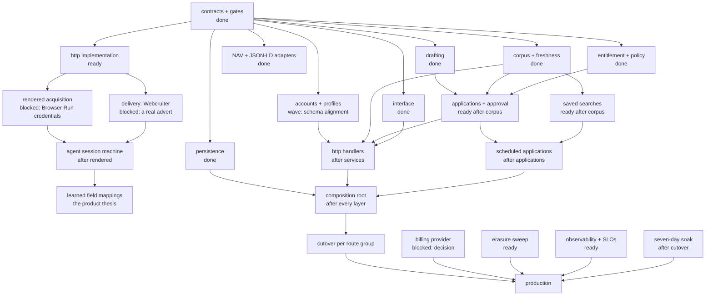

# Work dependency graph, to production

Companion to [the migration plan](WS-0012-r1-typescript-migration-plan.md). The
plan says how work is divided; this says what depends on what, what is
therefore concurrent, and what actually decides the finish date.

Statuses are `done`, `wave` (writing now), `ready` (contracts complete, nobody
assigned), `blocked` (waiting on a decision or a credential).

## The graph



## What wave 2 cost, and what it bought

Six slots merged. Between them they reported ten contract defects, and the
pattern is worth recording: every one was found by a writer meeting the
contract from the outside, and none by the writer who froze it.

Four are now closed — every table has a key, `canonical_jobs` and
`occurrences` exist, `ClosedCanonical` is reachable through a sweep that takes
what a run *saw*, and `Database` promises only the atomicity D1 can deliver.
The last of those was a contract whose shape invited a bug, and it collected
one from me before it was narrowed.

The lesson the next wave should carry: a slot testing against its own fake
proves its logic and nothing about the seam. Both the corpus and the accounts
slot passed green while disagreeing with the real schema. Running a slot
against the persistence layer's real SQLite engine is what turned that into a
failing test, and it costs milliseconds.

## What the shape tells us

**The fan-out is real and it is early.** Seven items depend only on the
contracts, which is why four are running at once. That was bought by freezing
the seams first, and it is spent now — later work narrows.

**The critical path is not the interesting work.**

```
contracts → persistence → composition → cutover → soak → production
```

Everything else is wide. Persistence is on the path because the composition
root cannot run without a real database layer, and the soak is on it because
seven days is seven days. The agent-and-learning work — the actual product
thesis — is *not* on the critical path to a production deployment, which is
worth saying plainly: we can ship a working job index before the learning loop
exists, and the learning loop is what makes the product defensible.

**Two blockers are credentials, not code.** Rendered acquisition and Webcruiter
delivery are both written-but-unverifiable without a Browser Run token and a
live advert. They can be *built* against recordings; they cannot be *believed*
until run against the real thing, and this repository has twice shipped code
that passed against fixtures and failed against reality.

## Concurrency by wave

| Wave | Items | Why they can overlap |
| --- | --- | --- |
| 1 (done) | drafting, adapters | contracts only |
| 2 (done) | persistence, corpus, accounts, interface | contracts only; each fakes the tags it consumes |
| 3 | saved searches, applications, http implementation, erasure sweep, observability | one upstream service each |
| 4 | agenda, handlers | several services |
| 5 | composition, cutover | serial by nature |

A slot depends on a *tag*, not an implementation, so wave 2's four items are
independent even though three of them will eventually run on the database layer
one of them is writing. That is the whole return on service-driven development:
the dependency is on a contract that already exists, not on a colleague who is
still typing.

## What "production ready" means here

Beyond the graph, these gate a real deployment and none is optional:

- **Billing.** `subscription_tier` has no payment behind it. Every premium gate
  is enforced correctly and grants nothing anyone has paid for.
- **Erasure.** The state exists in the model; the sweep that honours it does
  not.
- **Session auth.** Being written now; the interface cannot ship on API keys.
- **Observability.** The Rust service has SLOs and structured telemetry. The
  replacement has none yet, and a corpus that silently stops ingesting looks
  identical to a quiet week.
- **Soak.** Seven days on staging, as the existing release checklist requires.

## The honest risk

The critical path runs through work that is easy to schedule and the *value*
runs through work that is blocked on two credentials. If the Browser Run token
and a Webcruiter advert stay unavailable, we will arrive at a production-ready
job index whose distinguishing feature is unproven. That is the sequencing risk
worth watching, and it is resolved by two small operator actions rather than by
any amount of engineering.
